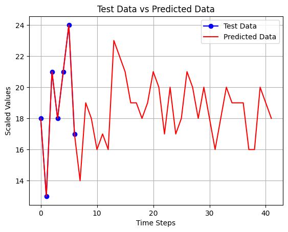
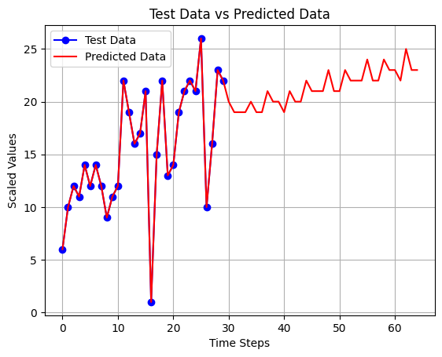
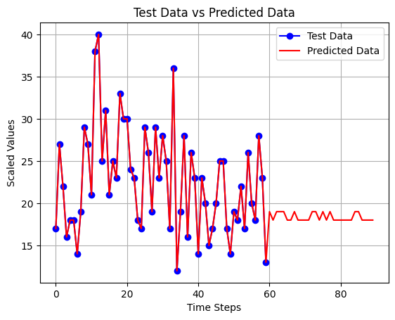
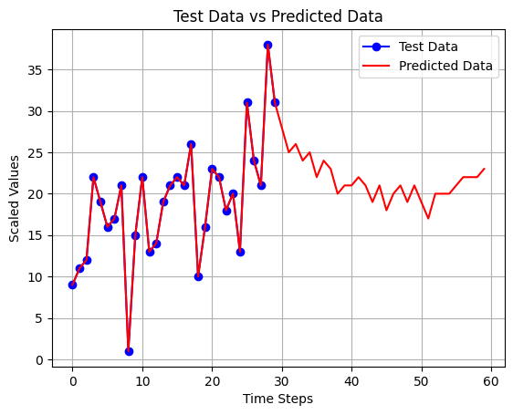
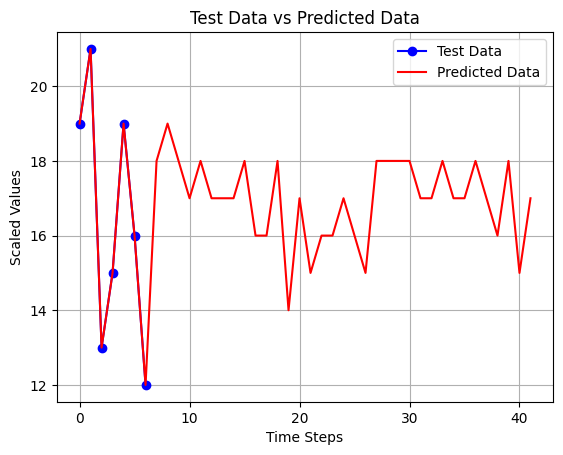
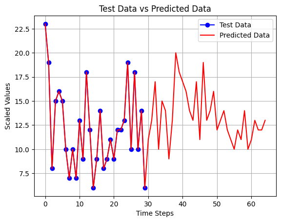
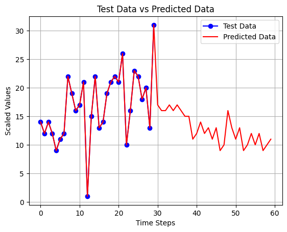
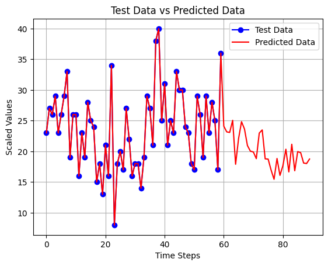

# **Overview**
## A forecast to predict YouTube channel subscribers for the next 30 days using LSTM and Dense models. For each model, I implemented four different methods: 7 inputs for 7 outputs, 30 inputs for 7 outputs, 30 inputs for 30 outputs, and 60 inputs for 30 outputs.I have included the results of each method in my README, which you can review.

# LSTM Models
## LSTM 7-7
### Total subscribers till 2024-11-13 : 6383, next_30_days: 651 ===> final after 30 days: 7034
### Error : MAE Train data  : 0.058 , MAE  Test data : 0.1214 

## LSTM 30-7
### Total subscribers till 2024-11-13 : 6383, next_30_days: 746 ===> final after 30 days: 7129
### Error : MAE Train data  : 0.1095 , MAE  Test data : 0.1263

## LSTM 60-30
### Total subscribers till 2024-11-13 : 6383, next_30_days: 551.0 ===> final after 30 days: 6934.0
### Error : MAE Train data  : 0.1249 , MAE  Test data : 0.1314

## LSTM 30-30
### Total subscribers till 2024-11-13 : 6383, next_30_days: 647.0 ===> final after 30 days: 7030.0
### Error : MAE Train data  : 0.1106 , MAE  Test data : 0.1148

# Dense Models

## Dense 7-7
### Total subscribers till 2024-11-13 : 6383, next_30_days: 594.0 ===> final after 30 days: 6977
### Error : MAE Train data  : 0.1006 , MAE  Test data : 0.1234

## Dense 30-7
### Total subscribers till 2024-11-13 : 6383, next_30_days: 470 ===> final after 30 days: 6853
### Error : MAE Train data  : 0.0683 , MAE  Test data : 0.1309

## Dense 30-30
### Total subscribers till 2024-11-13 00:00:00: 6383, next_30_days: 386= ===> final after 30 days: 6769
### Error : MAE Train data  : 0.0975 , MAE  Test data : 0.1357

## Dense 60-30
### Total subscribers till 2024-11-13 : 6383, next_30_days: 602.0 ===> final after 30 days: 6985
### Error : MAE Train data  : 0.0828 , MAE  Test data : 0.1357

