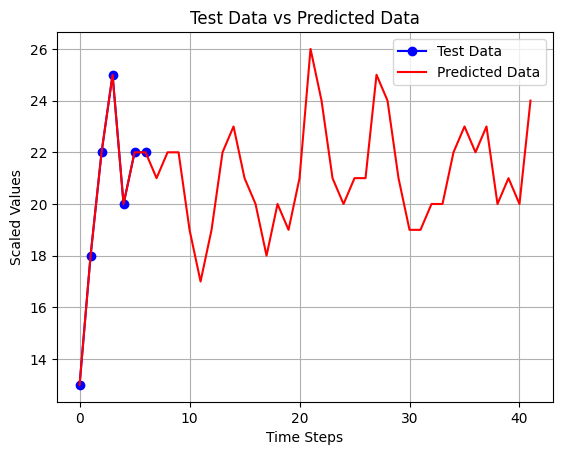
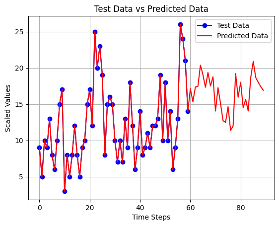

# YouTube Subscriber Forecasting Project

This project involves the development of a forecasting model to predict future YouTube subscriber growth over the next 30 days. The models used for prediction include both **Dense** and **LSTM (Long Short-Term Memory)** networks, leveraging cross-validation to calculate the mean of each model's loss across multiple folds. 

The detailed results of the model predictions and the corresponding performance metrics (Mean Absolute Error - MAE) are outlined below.

---

## Table of Contents
- [Project Overview](#project-overview)
- [Models and Results](#models-and-results)
  - [LSTM Models](#lstm-models)
  - [Dense Models](#dense-models)
- [Conclusion](#conclusion)

---

## Project Overview

In this project, we used a combination of **LSTM** and **Dense neural networks** to predict future YouTube subscriber counts for a 30-day period. Multiple model configurations were tested to compare their performance. Cross-validation was performed to compute the **Mean Absolute Error (MAE)** for each model, providing an average measure of the model's predictive accuracy across all folds.

All results, including predicted subscriber counts and performance metrics, are summarized in the sections below.

---

## Models and Results

### LSTM Models

#### **LSTM 7-7**
- **Subscribers until 2024-12-12**: 8117
- **Predicted subscribers (next 30 days)**: 682.0
- **Final subscriber count (after 30 days)**: 8799
- **Mean Loss (MAE) over all folds**: 0.1615
  
  

#### **LSTM 30-7**
- **Subscribers until 2024-12-12**: 8117
- **Predicted subscribers (next 30 days)**: 629.0
- **Final subscriber count (after 30 days)**: 8746
- **Mean Loss (MAE) over all folds**: 0.0959
  
  

#### **LSTM 60-30**
- **Subscribers until 2024-12-12**: 8117
- **Predicted subscribers (next 30 days)**: 616.0
- **Final subscriber count (after 30 days)**: 8733
- **Mean Loss (MAE) over all folds**: 0.1191
  
  

#### **LSTM 30-30**
- **Subscribers until 2024-12-12**: 8117
- **Predicted subscribers (next 30 days)**: 392.0
- **Final subscriber count (after 30 days)**: 8509
- **Mean Loss (MAE) over all folds**: 0.1828
  
  

### Dense Models

#### **Dense 7-7**
- **Subscribers until 2024-12-12**: 8117
- **Predicted subscribers (next 30 days)**: 740.0
- **Final subscriber count (after 30 days)**: 8857
- **Mean Loss (MAE) over all folds**: 0.1481
  
  

#### **Dense 30-7**
- **Subscribers until 2024-12-12**: 8117
- **Predicted subscribers (next 30 days)**: 832.0
- **Final subscriber count (after 30 days)**: 8949
- **Mean Loss (MAE) over all folds**: 0.1185
  
  

#### **Dense 60-30**
- **Subscribers until 2024-12-12**: 8117
- **Predicted subscribers (next 30 days)**: 497.0
- **Final subscriber count (after 30 days)**: 8614
- **Mean Loss (MAE) over all folds**: 0.1257
  
  

#### **Dense 30-30**
- **Subscribers until 2024-12-12**: 8117
- **Predicted subscribers (next 30 days)**: 460.0
- **Final subscriber count (after 30 days)**: 8577
- **Mean Loss (MAE) over all folds**: 0.1254
  
  

---

## Conclusion

This project demonstrates the ability of both **LSTM** and **Dense networks** to forecast YouTube subscriber growth with relatively low Mean Absolute Error. 

- The **LSTM 30-7 model** had the lowest error overall with an MAE of **0.0959** 🏆, making it the best performer in terms of accuracy.
- The **Dense 30-7 model** predicted a higher subscriber increase, but had a slightly higher error (MAE: **0.1185**) compared to LSTM 30-7.

The results show that both architectures can be valuable in predicting subscriber trends, with LSTM models potentially better suited for capturing sequential patterns, and Dense models providing strong overall performance.

