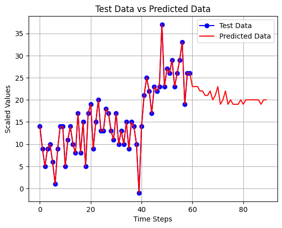

# YouTube Subscriber Forecasting Project

This project involves the development of a forecasting model to predict future YouTube subscriber growth over the next 30 days. The models used for prediction include both **Dense** and **LSTM (Long Short-Term Memory)** networks, leveraging cross-validation to calculate the mean of each model's loss across multiple folds. 

The detailed results of the model predictions and the corresponding performance metrics (Mean Absolute Error - MAE) are outlined below.

---

## Table of Contents
- [Project Overview](#project-overview)
- [Models and Results](#models-and-results)
  - [LSTM Models](#lstm-models)
  - [Dense Models](#dense-models)
- [Conclusion](#conclusion)

---

## Project Overview

In this project, we used a combination of **LSTM** and **Dense neural networks** to predict future YouTube subscriber counts for a 30-day period. Multiple model configurations were tested to compare their performance. Cross-validation was performed to compute the **Mean Absolute Error (MAE)** for each model, providing an average measure of the model's predictive accuracy across all folds.

All results, including predicted subscriber counts and performance metrics, are summarized in the sections below.

---

## Models and Results

### LSTM Models

#### **LSTM 7-7**
- **Subscribers until 2024-12-12**: 8117
- **Predicted subscribers (next 30 days)**: 682.0
- **Final subscriber count (after 30 days)**: 8799
- **Mean Loss (MAE) over all folds**: 0.1615
  
  

#### **LSTM 30-7**
- **Subscribers until 2024-12-12**: 8117
- **Predicted subscribers (next 30 days)**: 629.0
- **Final subscriber count (after 30 days)**: 8746
- **Mean Loss (MAE) over all folds**: 0.0959
  
  

#### **LSTM 60-30**
- **Subscribers until 2024-12-12**: 8117
- **Predicted subscribers (next 30 days)**: 616.0
- **Final subscriber count (after 30 days)**: 8733
- **Mean Loss (MAE) over all folds**: 0.1191
  
  

#### **LSTM 30-30**
- **Subscribers until 2024-12-12**: 8117
- **Predicted subscribers (next 30 days)**: 392.0
- **Final subscriber count (after 30 days)**: 8509
- **Mean Loss (MAE) over all folds**: 0.1828
  
  

### Dense Models

#### **Dense 7-7**
- **Subscribers until 2024-12-12**: 8117
- **Predicted subscribers (next 30 days)**: 740.0
- **Final subscriber count (after 30 days)**: 8857
- **Mean Loss (MAE) over all folds**: 0.1481
  
  

#### **Dense 30-7**
- **Subscribers until 2024-12-12**: 8117
- **Predicted subscribers (next 30 days)**: 832.0
- **Final subscriber count (after 30 days)**: 8949
- **Mean Loss (MAE) over all folds**: 0.1185
  
  

#### **Dense 60-30**
- **Subscribers until 2024-12-12**: 8117
- **Predicted subscribers (next 30 days)**: 497.0
- **Final subscriber count (after 30 days)**: 8614
- **Mean Loss (MAE) over all folds**: 0.1257
  
  

#### **Dense 30-30**
- **Subscribers until 2024-12-12**: 8117
- **Predicted subscribers (next 30 days)**: 460.0
- **Final subscriber count (after 30 days)**: 8577
- **Mean Loss (MAE) over all folds**: 0.1254
  
  

---
### Predicted Subscriber Growth

#### Predicted Subscribers for Each Model

- **LSTM 7-7**: 682.0 subscribers
- **LSTM 30-7**: 629.0 subscribers
- **LSTM 60-30**: 616.0 subscribers
- **LSTM 30-30**: 392.0 subscribers
- **Dense 7-7**: 740.0 subscribers
- **Dense 30-7**: 832.0 subscribers
- **Dense 60-30**: 497.0 subscribers
- **Dense 30-30**: 460.0 subscribers

#### Sum of Predicted Subscribers

The total number of predicted subscribers across all models is calculated as follows:

```
682.0 + 629.0 + 616.0 + 392.0 + 740.0 + 832.0 + 497.0 + 460.0 = 4848.0
```

Thus, the **sum of predicted subscribers** is **4848.0**.

#### Number of Models

There are a total of **8 models** used for prediction.

#### Average Predicted Subscribers

The **average number of predicted subscribers** over the next 30 days across all models is calculated by dividing the total sum by the number of models:

```
Average = 4848.0 ÷ 8 = 606.0
```

Adding this average increase to the initial count of **8117 subscribers**:

```
8117 + 606.0 = 8723
```

This average **final subscriber count** is **8723**.

However, the best model, **LSTM 30-7**, predicts the final subscriber count to be **8746** by **01/12/2025**.

### Conclusion

- The **LSTM 30-7 model** had the lowest error overall with an MAE of **0.0959**, making it the best performer in terms of accuracy.

Based on the models, the **average predicted growth** is **606 subscribers** over the next 30 days, bringing the estimated total to **8723 subscribers**. The **best model (LSTM 30-7)** predicts a final count of **8746**, which is very close to the **actual recorded count of 8750 subscribers** on **01/12/2025**.

This confirms that the forecasting models can effectively predict subscriber growth, with small differences compared to real-world results.


