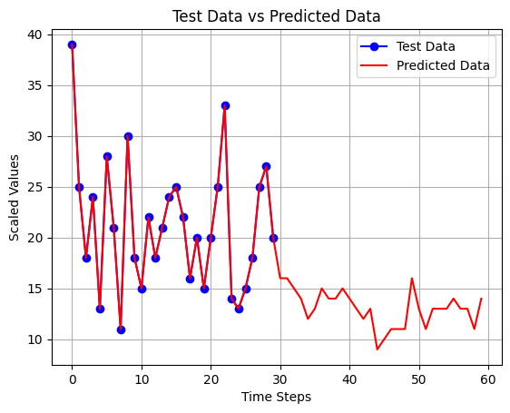

# LSTM Models
## LSTM 7-7
### Total subscribers till 2024-11-13 : 6383, next_30_days: 718 ===> final after 30 days: 7101
### Error : MAE Train data  : 0.0702 , MAE  Test data : 0.1168

## LSTM 30-7
### Total subscribers till 2024-11-13 : 6383, next_30_days: 645 ===> final after 30 days: 7028
### Error : MAE Train data  : 0.1340 , MAE  Test data : 0.1419

## LSTM 60-30
### Total subscribers till 2024-11-13 : 6383, next_30_days: 530 ===> final after 30 days: 6913
### Error : MAE Train data  : 0.1271 , MAE  Test data : 0.1259

## LSTM 30-30
### Total subscribers till 2024-11-13 : 6383, next_30_days: 444 ===> final after 30 days: 6827
### Error : MAE Train data  : 0.1235 , MAE  Test data : 0.1310

# Dense Models

## Dense 7-7
### Total subscribers till 2024-11-13 : 6383, next_30_days: 594.0 ===> final after 30 days: 6977
### Error : MAE Train data  : 0.1006 , MAE  Test data : 0.1234

## Dense 30-7
### Total subscribers till 2024-11-13 : 6383, next_30_days: 470 ===> final after 30 days: 6853
### Error : MAE Train data  : 0.0683 , MAE  Test data : 0.1309

## Dense 30-30
### Total subscribers till 2024-11-13 00:00:00: 6383, next_30_days: 386= ===> final after 30 days: 6769
### Error : MAE Train data  : 0.0975 , MAE  Test data : 0.1357

## Dense 60-30
### Total subscribers till 2024-11-13 : 6383, next_30_days: 602.0 ===> final after 30 days: 6985
### Error : MAE Train data  : 0.0828 , MAE  Test data : 0.1357

